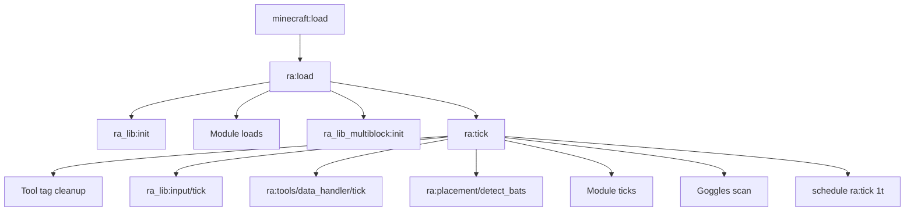
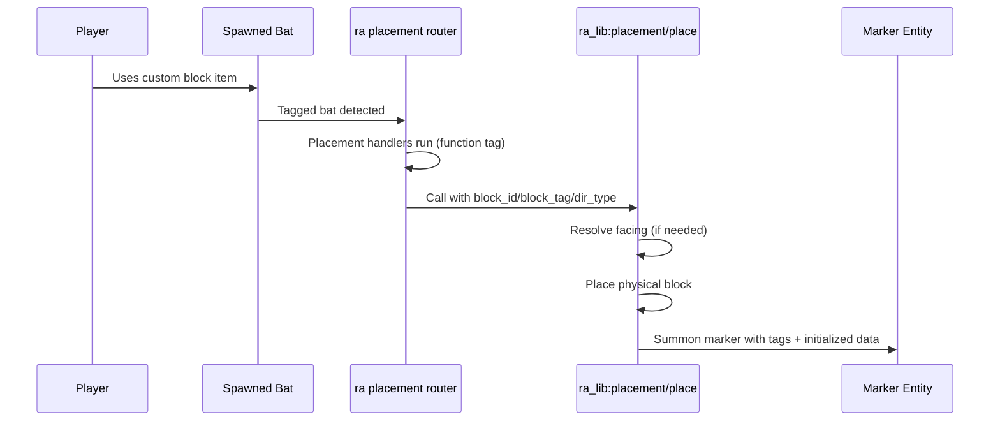
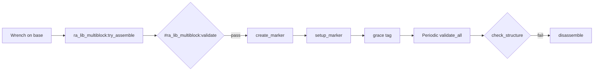

# How It Works

This page explains the runtime architecture of Redstone Additions in detail.

Use this as the canonical technical reference for the pack flow. Module pages focus on behavior and block details, while this page explains system internals.

## Runtime At A Glance

## 1) Load Pipeline

Core load entrypoint is `ra:load`.

Responsibilities:

- Creates shared scoreboards for editing and runtime bookkeeping.
- Initializes shared temporary storage `ra:temp`.
- Initializes shared libraries via `ra_lib:init`.
- Initializes gameplay namespaces (`ra_interactive`, `ra_storage`, `ra_sensors`, `ra_gates`, `ra_wireless`, `ra_wires`, `ra_chunk_loader`, `ra_multiblock`).
- Initializes multiblock library state via `ra_lib_multiblock:init`.
- Starts the recurring tick loop by calling `ra:tick`.

## 2) Tick Orchestration

`ra:tick` is scheduled every tick and acts as the orchestrator:

1. Clears stale click/active tool tags.
2. Runs modular input sessions (`ra_lib:input/tick`).
3. Runs Data Handler action/pending processing (`ra:tools/data_handler/tick`).
4. Runs placement detection (`ra:placement/detect_bats`).
5. Dispatches module ticks in fixed order.
6. Runs goggles scan (`ra:tools/goggles/tick`).
7. Re-schedules itself (`schedule function ra:tick 1t`).

This architecture keeps all state transitions deterministic and centralized.

## 3) Placement Lifecycle (Item -> Block -> Marker)

Custom blocks are represented as bat spawn egg items with custom data and placement tags.

Required item traits:

- `custom_data` marker for block type.
- `entity_data` that spawns a bat with `ra.spawned` and `ra.place.<block_id>` tags.

Placement flow:

### Handler Routing

Placement handlers are resolved through function tags, allowing each module to register block-specific `handle_placement` functions without changing core router logic.

### Marker Creation Contract

`ra_lib:placement/place` performs all generic placement work:

- Resolves orientation (for direction-sensitive blocks).
- Places physical block using helper functions.
- Summons marker entity with base tags:
  - `ra.custom_block`
  - `ra.custom_block.<id>`
  - `ra.new`
- Initializes marker data root so later writes are safe.

Callers are responsible for removing `ra.new` after first-tick initialization.

## 4) Marker State Model

Runtime block state is marker-centric.

Conventions:

- `data.properties.*`: configurable values (CDH editable).
- `data.data.*`: runtime processing state.
- `data.status.*`: status values intended for goggles/display output.

Common tags:

- `ra.custom_block`: any custom marker.
- `ra.custom_block.<id>`: typed marker classification.
- `ra.new`: one-tick setup marker.
- `ra.broken`: break cleanup queue.

This separation keeps user-edited values and transient machine state distinct.

## 5) Shared Library Responsibilities (`ra_lib`)

`ra_lib` is the generic runtime toolbox for all gameplay namespaces.

### placement/

- `place`: canonical custom-block placement helper.
- `set_block`: dispatches simple or facing-aware placement.
- `set_block_facing` and `set_block_simple`: final block placement variants.

### orientation/

- `get_facing`: computes cardinal or full 3D facing from player rotation using `dir_type`.
- `set_facing`: stores resolved facing and canonical rotation values.

### redstone/

- `detect`: gathers power from multiple sources and updates both world-space and look-space power scoreboards.
- `detect/*`: source-specific detectors (dust, repeater, comparator, lever, button, block, torch).
- `clear`: resets tags and prior signal state before a new detection pass.

Redstone output contract:

- `ra.power`: aggregate max power (`0..16`)
- world-space: `ra.power.north/south/east/west/up/down`
- look-space: `ra.power.front/back/left/right/local_up/local_down`
- `16` is reserved for superpower from direct powered repeater/comparator output

Runtime usage note:

- Gates and wireless emitter run `ra_lib:redstone/detect` directly inside their per-block process functions.
- The old gate-wide signal sweep function is no longer part of active tick flow.

### inventory/

- `insert`: uses loot insert mechanics for stack-safe insertion.
- `remove`: macro-based counted removal from container slots.
- `clear`: reset helper for temporary inventory storage states.

### input/

- `init`: creates input objectives and initializes session storage roots.
- `tick`: advances active sessions each tick via selected backend router.
- `poll` / `consume`: runtime API used by Data Handler pending-edit flow.

Backends:

- `trigger`: numeric input submit/validation flow.
- `writable_book`: text capture flow from temporary Input Form book.

Safety behavior:

- `give_book_safe` prevents giving books when inventory is full and emits a red warning.
- `kill_dropped_req` clears dropped request books using request-aware matching.
- cleanup/restore paths return the original held item state after text submission or cancel.

## 6) Tool Runtime

## Wrench

Used for mode cycling and multiblock interactions:

- Detects target custom marker.
- Dispatches per-block cycle/toggle logic.
- Runs multiblock assembly attempts for base blocks.

## Creative Data Handler (CDH)

Property editor for marker entities:

- Detects target marker and writes targeting state to storage.
- Enumerates/edit properties through dedicated property functions.
- Uses tellraw-driven interaction menus for edit operations.

## Data Handler

- Detects nearby target marker on Shift+RMB and opens trigger-driven edit menu.
- Routes numeric and text edits through `ra_lib:input` session APIs.
- Applies consumed values back into marker `data.properties` and refreshes menu.
- Supports explicit pending-edit cancel without requiring op-level raw `/data` edits.

## Goggles

Status overlay system:

- Detects players wearing/holding goggles.
- Throttles scans on timer (every 40 ticks).
- Clears old billboards each cycle.
- Scans nearby blocks/multiblocks through centralized scanners (`ra:tools/goggles/scan_blocks` and `ra:tools/goggles/scan_multiblocks`).
- Renders status billboards only for blocks that opt in.

Block-level rendering control:

- Block draw handlers populate `storage ra:temp billboard` and call `ra:tools/goggles/billboard/handle_billboard`.
- `show_name` and `show_status` are explicit opt-in flags.
- If neither flag is set but `name` exists, the handler defaults to name rendering for backward compatibility.
- If neither flag nor `name` is present, no billboard is rendered.
- This keeps overlays focused on blocks that expose meaningful runtime data.

## 7) Multiblock Lifecycle (`ra_lib_multiblock`)

`ra_lib_multiblock` abstracts assembly and validity checks so `ra_multiblock` can focus on structure-specific logic.

Core functions:

- `try_assemble`: runs type validator hooks and creates marker on success.
- `create_marker`: summons centered marker and triggers setup flow.
- `setup_marker`: writes standardized typed data (`type`, `facing`, `properties`, `inputs`, `outputs`, `controls`).
- `validate_all`: periodic pass over all multiblock markers.
- `validate_single`: per-marker structure validity check.
- `disassemble`: type-specific cleanup hook and marker removal.

## 8) Namespace Boundaries

- `ra`: orchestrator, placement detection, tools, uninstall.
- `ra_lib`: shared generic systems.
- `ra_lib_multiblock`: shared multiblock runtime.
- `ra_interactive`, `ra_storage`, `ra_gates`, `ra_sensors`, `ra_wireless`, `ra_wires`, `ra_chunk_loader`: module behavior.
- `ra_multiblock`: concrete multiblock structures and base blocks.
- `ra_advancements`: progression triggers/unlocks.

## 9) Contributor Mental Model

When adding features, decide first:

1. Is this generic and reusable? Add in `ra_lib` or `ra_lib_multiblock`.
2. Is this gameplay-specific? Add in the target module namespace.
3. Does it need configuration? Store in `data.properties`.
4. Does it need user-visible diagnostics? Store in `data.status` and expose via goggles.

Keep placement tags, block IDs, recipes, and advancements consistent. Most runtime bugs in datapacks come from mismatched IDs across those files.

---

Next: [Developer Guide](developer-guide.md) for implementation workflow and extension checklists.

