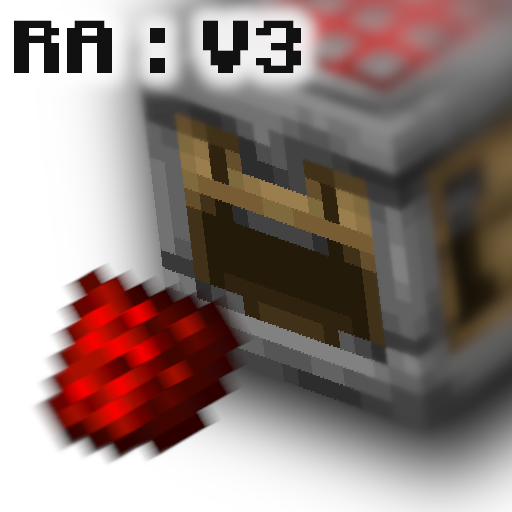

# Redstone Additions



**Version:** v5.1.1  
**Minecraft:** 1.21+  
**Author:** [AnCarsenat](https://github.com/AnCarsenat)

---

Redstone Additions is a vanilla datapack with automation, storage, wireless signaling, sensors, chunk loading, multiblocks, and transport networks.

!!! tip "Player-first wiki"
    This home page is intentionally dense so most players can stay on one page and only open extra docs when they need deep technical details.

## Quick Start

1. Download from [Modrinth](https://modrinth.com/datapack/redstone-additions) or clone from GitHub.
2. Place `redstone_additions` in your world datapacks folder.
3. Run `/reload`.
4. Run `/function ra:give_all_items` to get one prefilled bundle per namespace.

Path example:

```text
.minecraft/saves/<world>/datapacks/redstone_additions/
```

## Visual Module Atlas

| Module | What you get | Recipe preview |
|---|---|---|
| [Logic Gates](logic-gates.md) | 6 timing/logic blocks | { width="220" } |
| [Interactive Machines](interactive-machines.md) | 11 automation/utility blocks | { width="220" } |
| [Storage](storage.md) | Boxer + Unboxer workflow | { width="220" } |
| [Sensors](sensors.md) | Entity detector + tag operators | { width="220" } |
| [Wireless Redstone](wireless-redstone.md) | Emitter, Receiver, and Remote | { width="220" } |
| [Transport Networks](transport-networks.md) | Liquid, gas, and EU transport | { width="220" } |
| [Chunk Loader](chunk-loader.md) | 1 force-load block | { width="220" } |
| [Multiblocks](multiblocks.md) | 5 base tiers + structures | { width="220" } |

Current pack totals:

- 46 placeable custom blocks
- 5 tools (Wrench, Creative Data Handler, Data Handler, Goggles, Redstone Remote)

## Commands Most Players Need

| Command | Purpose |
|---|---|
| `/function ra:give_all_items` | Full starter kit (all namespaces) |
| `/function ra_gates:items/give_all` | Logic gates bundle |
| `/function ra_interactive:items/give_all` | Interactive machines bundle |
| `/function ra_storage:items/give_all` | Boxer and Unboxer bundle |
| `/function ra_sensors:items/give_all` | Sensor bundle |
| `/function ra_wireless:items/give_all` | Wireless bundle |
| `/function ra_wires:items/give_all` | Transport/EU bundle |
| `/function ra_chunk_loader:items/give_all` | Chunk loader bundle |
| `/function ra_multiblock:blocks/give_all` | Multiblock bases |
| `/function ra:uninstall` | Opens uninstall confirmation dialog |

## Tools At A Glance

| Tool | Give command | Recipe preview | Main use |
|---|---|---|---|
| Wrench | `/function ra:tools/wrench/give` | { width="200" } | Mode cycling and multiblock assembly |
| Data Handler | `/function ra:tools/data_handler/give` | { width="200" } | Edit nearby block `data.properties` |
| Goggles | `/function ra:tools/goggles/give` | { width="200" } | In-world status overlays |

## What Is New In v5.1.1

- Added `ra_wires` namespace with liquid, gas, and electric transport blocks.
- Added liquid drain fallback behavior when no source can be drained.
- Added goggles tinkering for transport blocks (toggle/cycle runtime properties).
- Added full recipe and advancement coverage for transport and EU blocks.

## Need More Detail

For most players, this home page plus [Block Reference](block-reference.md) is enough.

Open these pages only when needed:

- [Storage](storage.md)
- [Wireless Redstone](wireless-redstone.md)
- [How It Works](how-it-works.md)
- [Recipe Reference](recipe-reference.md)
- [Developer Guide](developer-guide.md)
- [Extension Examples](extension-examples.md)
- [Changelog](changelog.md)

## Support

- [GitHub Repository](https://github.com/AnCarsenat/Redstone-Additions)
- [Issues](https://github.com/AnCarsenat/Redstone-Additions/issues)
- [Modrinth](https://modrinth.com/datapack/redstone-additions)

