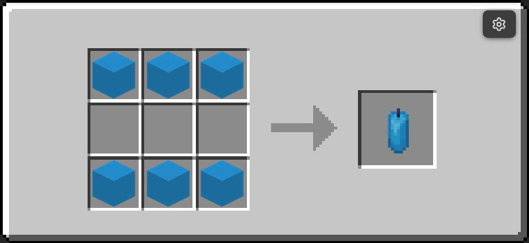
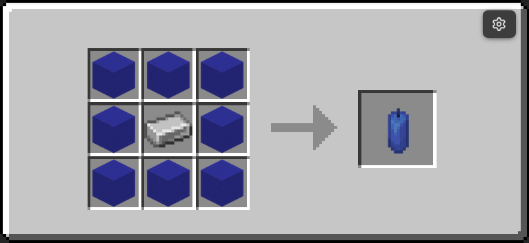
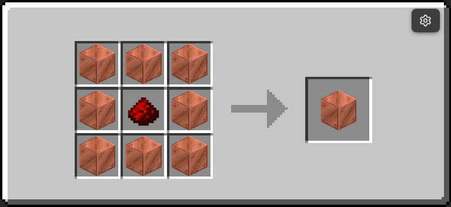
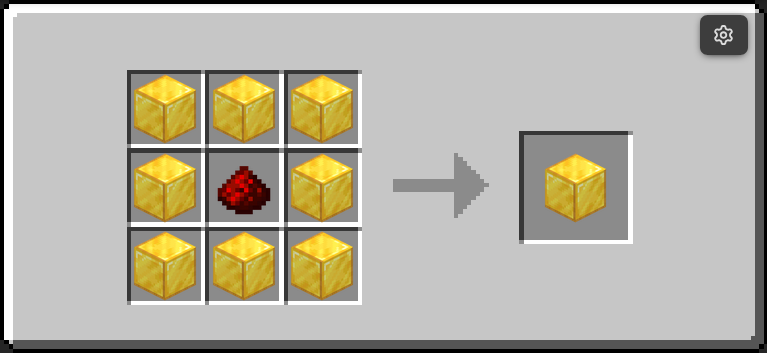
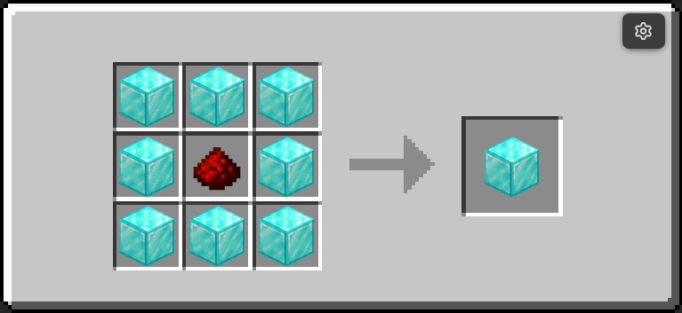
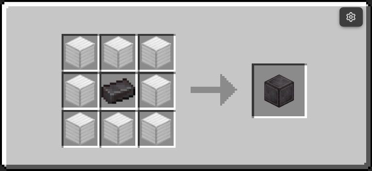

# Item Reference

This matrix is generated from block folders, placement handler registrations, and recipe files in `redstone_additions/data`.

For lifecycle internals and marker architecture, see [How It Works](how-it-works.md).

## Blocks

| Module          | Block ID                  | Display name              | Recipe |
| --------------- | ------------------------- | ------------------------- | ------ |
| ra_gates        | uni_gate                  | UNI Gate                  | Yes    |
| ra_gates        | clock                     | Clock                     | Yes    |
| ra_gates        | delayer                   | Delayer                   | Yes    |
| ra_gates        | extender                  | Extender                  | Yes    |
| ra_gates        | rand                      | Randomizer                | Yes    |
| ra_gates        | shortener                 | Shortener                 | Yes    |
| ra_interactive  | block_breaker             | Block Breaker             | Yes    |
| ra_interactive  | block_placer              | Block Placer              | Yes    |
| ra_interactive  | item_pipe                 | Item Pipe                 | Yes    |
| ra_interactive  | item_mover                | Item Mover                | Yes    |
| ra_interactive  | spitter                   | Spitter                   | Yes    |
| ra_interactive  | pusher                    | Pusher                    | Yes    |
| ra_interactive  | breeder                   | Breeder                   | Yes    |
| ra_interactive  | infinite_water_cauldron   | Infinite Water Cauldron   | Yes    |
| ra_interactive  | infinite_lava_cauldron    | Infinite Lava Cauldron    | Yes    |
| ra_interactive  | infinite_snow_cauldron    | Infinite Snow Cauldron    | Yes    |
| ra_interactive  | message_block             | Message Block             | Yes    |
| ra_storage      | boxer                     | Boxer                     | Yes    |
| ra_storage      | unboxer                   | Unboxer                   | Yes    |
| ra_sensors      | entity_detector           | Entity Detector           | Yes    |
| ra_sensors      | tag_adder                 | Tag Adder                 | Yes    |
| ra_sensors      | tag_remover               | Tag Remover               | Yes    |
| ra_wireless     | emitter                   | Wireless Emitter          | Yes    |
| ra_wireless     | receiver                  | Wireless Receiver         | Yes    |
| ra_wires        | liquid_pipe (copper)      | Copper Liquid Pipe        | Yes    |
| ra_wires        | liquid_pipe (netherite)   | Netherite Liquid Pipe     | Yes    |
| ra_wires        | liquid_tank               | Liquid Tank               | Yes    |
| ra_wires        | liquid_pump               | Liquid Pump               | Yes    |
| ra_wires        | liquid_valve              | Liquid Valve              | Yes    |
| ra_wires        | liquid_drain              | Liquid Drain              | Yes    |
| ra_wires        | gas_pipe (copper)         | Copper Gas Pipe           | Yes    |
| ra_wires        | gas_pipe (netherite)      | Netherite Gas Pipe        | Yes    |
| ra_wires        | gas_tank                  | Gas Tank                  | Yes    |
| ra_wires        | gas_pump                  | Gas Pump                  | Yes    |
| ra_wires        | gas_valve                 | Gas Valve                 | Yes    |
| ra_wires        | electric_wire (copper)    | Copper Electric Wire      | Yes    |
| ra_wires        | electric_wire (netherite) | Netherite Electric Wire   | Yes    |
| ra_wires        | electric_generator        | EU Generator              | Yes    |
| ra_wires        | electric_consumer         | EU Consumer               | Yes    |
| ra_wires        | electric_switch           | EU Switch                 | Yes    |
| ra_chunk_loader | chunk_loader              | Chunk Loader              | Yes    |
| ra_multiblock   | copper_base               | Copper Multiblock Base    | Yes    |
| ra_multiblock   | iron_base                 | Iron Multiblock Base      | Yes    |
| ra_multiblock   | gold_base                 | Gold Multiblock Base      | Yes    |
| ra_multiblock   | diamond_base              | Diamond Multiblock Base   | Yes    |
| ra_multiblock   | netherite_base            | Netherite Multiblock Base | Yes    |

## Recipe Images (Placeable Blocks)

| Module          | Block ID                  | Recipe image                                                                                                |
| --------------- | ------------------------- | ----------------------------------------------------------------------------------------------------------- |
| ra_gates        | uni_gate                  | { width="220" }                                     |
| ra_gates        | clock                     | { width="220" }                                           |
| ra_gates        | delayer                   | { width="220" }                                       |
| ra_gates        | extender                  | { width="220" }                                     |
| ra_gates        | rand                      | { width="220" }                                 |
| ra_gates        | shortener                 | { width="220" }                                   |
| ra_interactive  | block_breaker             | { width="220" }                     |
| ra_interactive  | block_placer              | { width="220" }                       |
| ra_interactive  | item_pipe                 | { width="220" } (recipe currently disabled) |
| ra_interactive  | item_mover                | { width="220" }                           |
| ra_interactive  | spitter                   | { width="220" }                                 |
| ra_interactive  | pusher                    | Image pending                                                                                               |
| ra_interactive  | breeder                   | { width="220" }                                 |
| ra_interactive  | infinite_water_cauldron   | { width="220" }  |
| ra_interactive  | infinite_lava_cauldron    | { width="220" }   |
| ra_interactive  | infinite_snow_cauldron    | { width="220" }   |
| ra_interactive  | message_block             | { width="220" }                           |
| ra_storage      | boxer                     | { width="220" }                                         |
| ra_storage      | unboxer                   | { width="220" }                                     |
| ra_sensors      | entity_detector           | { width="220" }                     |
| ra_sensors      | tag_adder                 | { width="220" }                                 |
| ra_sensors      | tag_remover               | { width="220" }                             |
| ra_wireless     | emitter                   | { width="220" }                           |
| ra_wireless     | receiver                  | { width="220" }                         |
| ra_wires        | liquid_pipe (copper)      | { width="220" }                        |
| ra_wires        | liquid_pipe (netherite)   | { width="220" }                       |
| ra_wires        | liquid_tank               | { width="220" }                               |
| ra_wires        | liquid_pump               | { width="220" }                               |
| ra_wires        | liquid_valve              | { width="220" }                             |
| ra_wires        | liquid_drain              | { width="220" }                             |
| ra_wires        | gas_pipe (copper)         | { width="220" }                           |
| ra_wires        | gas_pipe (netherite)      | { width="220" }                          |
| ra_wires        | gas_tank                  | { width="220" }                                     |
| ra_wires        | gas_pump                  | { width="220" }                                     |
| ra_wires        | gas_valve                 | { width="220" }                                   |
| ra_wires        | electric_wire (copper)    | { width="220" }                      |
| ra_wires        | electric_wire (netherite) | { width="220" }                |
| ra_wires        | electric_generator        | { width="220" }                             |
| ra_wires        | electric_consumer         | { width="220" }                               |
| ra_wires        | electric_switch           | { width="220" }                                   |
| ra_chunk_loader | chunk_loader              | { width="220" }                      |
| ra_multiblock   | copper_base               | { width="220" }               |
| ra_multiblock   | iron_base                 | Image pending                                                                                               |
| ra_multiblock   | gold_base                 | { width="220" }                   |
| ra_multiblock   | diamond_base              | { width="220" }             |
| ra_multiblock   | netherite_base            | { width="220" }         |

## Tools

| Module | Tool                  | Give function                         | Recipe         |
| ------ | --------------------- | ------------------------------------- | -------------- |
| ra     | Wrench                | `ra:tools/wrench/give`                | { width="220" } |
| ra     | Creative Data Handler | `ra:tools/creative_data_handler/give` | { width="220" } |
| ra     | Data Handler          | `ra:tools/data_handler/give`          | { width="220" } |
| ra     | Goggles               | `ra:tools/goggles/give`               | { width="220" } |

