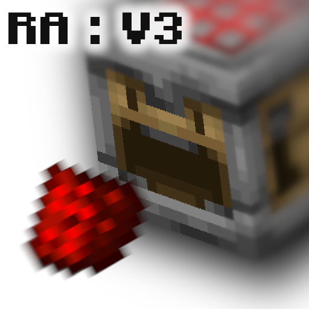

<p align="center">
  
</p>

<h1 align="center">Redstone Additions V3</h1>

<p align="center">
  <strong>23 custom blocks. 3 tools. Zero mods. Pure vanilla datapack magic.</strong>
</p>

<p align="center">
  <a href="https://modrinth.com/datapack/redstone-additions-v3"></a>
  <a href="https://github.com/AnCarsenat/Redstone-Additions-V3"></a>
</p>

<p align="center">
  
  
  
  
</p>

---

Tired of cramming 50 repeaters into ugly circuits? Wish Minecraft had proper logic gates, auto-farmers, or wireless redstone — without installing a single mod?

**Redstone Additions V3** drops 23 custom blocks and 3 tools into vanilla Minecraft. Every block is craftable in survival, appears in your recipe book, and works on servers with zero dependencies. Place a single UNI Gate and cycle it through AND, OR, XOR, NAND — all seven logic modes — with one click of the Wrench. Wire up Block Breakers and Item Pipes for fully automated farms. Detect entities, breed animals on a timer, or transmit redstone signals wirelessly across your entire world.

This is what redstone should have been.

---

## What's Inside

### ⚡ Logic Gates — *Think smaller*
One block replaces an entire wall of redstone. The **UNI Gate** handles all seven Boolean modes in a compact 3×3×3 multiblock that reads signals from all six directions. Need a clock? A pulse shortener? A randomizer? There's a block for each, and they all fit in a single chunk corner.

### 🏭 Interactive Machines — *Automate everything*
**Block Breaker** mines the block in front of it when powered. **Block Placer** does the opposite. Chain them with **Item Pipes** to build factories. **Spitters** launch items, **Pushers** launch entities, **Breeders** feed and breed animals automatically. Three **Infinite Cauldrons** give you unlimited water, lava, or snow. The **Message Block** displays custom text when powered — perfect for adventure maps.

### 👁️ Sensors — *See what's there*
**Entity Detector** outputs redstone when it spots a configurable entity type within a configurable range. **Tag Adder** and **Tag Remover** let you tag entities that enter their radius — the building blocks for mob sorting, scoring systems, or custom minigames.

### 📡 Wireless Redstone — *No line of sight required*
Place an **Emitter**, set a channel, power it. Place a **Receiver** on the same channel anywhere in the world — it lights up. The **Redstone Remote** lets you pulse any channel from your hand. Channels go from 1 to 65,535, so you'll never run out.

### 🔧 Tools
- **Wrench** — Shift+right-click on blocks to cycle modes, configure settings, and interact with multiblock structures.
- **Creative Data Handler** — Inspect and live-edit every property on every custom block. Change channels, ranges, delays, entity types, messages — all from a clickable chat menu.

---

## Install in 60 Seconds

**Option A — Modrinth (recommended)**
1. Grab the latest `.zip` from [Modrinth](https://modrinth.com/datapack/redstone-additions-v3)
2. Drop it into `.minecraft/saves/<your_world>/datapacks/`
3. Run `/reload` in-game

**Option B — GitHub**
```bash
git clone https://github.com/AnCarsenat/Redstone-Additions-V3.git
```
Copy the `redstone_additions_v3.0.0` folder into your world's `datapacks/` directory, then `/reload`.

**Get every item instantly:**
```
/function ra:give_all_items
```

No Fabric. No Forge. No Optifine conflicts. Just drop and play.

---

## Useful Commands

| Command | What it does |
|---------|--------------|
| `/function ra:give_all_items` | Every block and tool in your inventory |
| `/function ra_gates:items/give_all` | All logic gate items |
| `/function ra_interactive:items/give_all` | All interactive machines |
| `/function ra_sensors:items/give_all` | All sensor items |
| `/function ra_wireless:items/give_all` | All wireless items |
| `/function ra:tools/wrench/give` | The Wrench |
| `/function ra:tools/creative_data_handler/give` | The Creative Data Handler |
| `/function ra:uninstall` | Clean uninstall — removes all markers |

---

## How It Works Under the Hood

Custom blocks are placed as **Bat Spawn Eggs** with special NBT. On placement, the bat is instantly replaced with a real block (dispenser, dropper, etc.) and an invisible armor stand that tracks state, facing, and properties. Every tick, the system reads each marker and runs the matching block logic. This means full survival compatibility, recipe book integration, and zero mods.

The codebase is split into modular namespaces (`ra`, `ra_lib`, `ra_gates`, `ra_interactive`, `ra_sensors`, `ra_wireless`) so each addon is self-contained. Want to add your own custom block? The `ra_lib` library gives you orientation detection, redstone sensing from all 6 faces, placement helpers, and inventory utilities out of the box.

**Read the full [Developer Guide](https://github.com/AnCarsenat/Redstone-Additions-V3/wiki/Developer-Guide) to start building your own blocks.**

---

## Documentation

The complete wiki covers every block, recipe, property, and technical detail:

| Page | Content |
|------|---------|
| [Logic Gates](https://github.com/AnCarsenat/Redstone-Additions-V3/wiki/Logic-Gates) | UNI Gate, Clock, Delayer, Extender, Shortener, Randomizer |
| [Interactive Machines](https://github.com/AnCarsenat/Redstone-Additions-V3/wiki/Interactive-Machines) | Block Breaker, Placer, Item Pipe, Spitter, Pusher, Breeder, Cauldrons, Message Block |
| [Sensors](https://github.com/AnCarsenat/Redstone-Additions-V3/wiki/Sensors) | Entity Detector, Tag Adder, Tag Remover |
| [Wireless Redstone](https://github.com/AnCarsenat/Redstone-Additions-V3/wiki/Wireless-Redstone) | Emitter, Receiver, Redstone Remote |
| [Developer Guide](https://github.com/AnCarsenat/Redstone-Additions-V3/wiki/Developer-Guide) | Custom block creation, library API, code templates |
| [Changelog](https://github.com/AnCarsenat/Redstone-Additions-V3/wiki/Changelog) | Full version history |

---

## Lates changelog

### v3.1.0 — February 2026
- Wireless Redstone system (Emitter, Receiver, Remote)
- Remote pulses receivers with 4-tick duration
- Creative Data Handler live-editing for all block properties
- Clickable [Modify] / [Edit All] buttons in CDH menu
- Full advancement tree for every addon
- `ra_wireless` namespace

---

## Contributing

Pull requests are welcome. Fork the repo, create a branch, test in both creative and survival, and submit. If you're building a new block, follow the patterns in the [Developer Guide](https://github.com/AnCarsenat/Redstone-Additions-V3/wiki/Developer-Guide).

For bug reports, open an [issue on GitHub](https://github.com/AnCarsenat/Redstone-Additions-V3/issues).

---

## License

**Copyright (c) 2026 AnCarsenat. All rights reserved.**

You are free to **use** this datapack on any world or server and to **modify** it for private use. You may **not** redistribute, reupload, mirror, or repackage it — in whole or in part — on any platform without explicit written permission from the author. Linking to the official [Modrinth](https://modrinth.com/datapack/redstone-additions-v3) or [GitHub](https://github.com/AnCarsenat/Redstone-Additions-V3) pages is always permitted.

If you feature this datapack in videos, streams, or articles, please credit **AnCarsenat** and link to the official repository.

See the full [LICENSE](LICENSE) file for complete terms.

---

<p align="center">
  <strong>Created by <a href="https://github.com/AnCarsenat">AnCarsenat</a></strong><br>
  <a href="https://github.com/AnCarsenat/Redstone-Additions-V3/issues">Report a Bug</a> · <a href="https://github.com/AnCarsenat/Redstone-Additions-V3/wiki">Wiki</a> · <a href="https://modrinth.com/datapack/redstone-additions-v3">Download</a>
</p>
